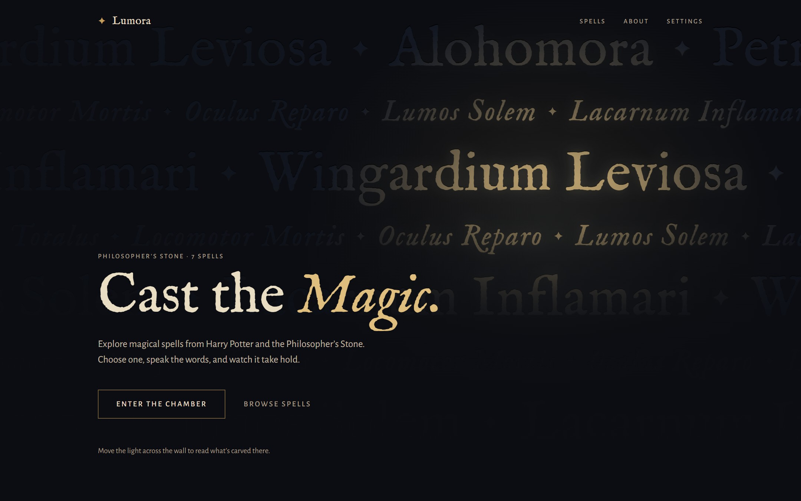
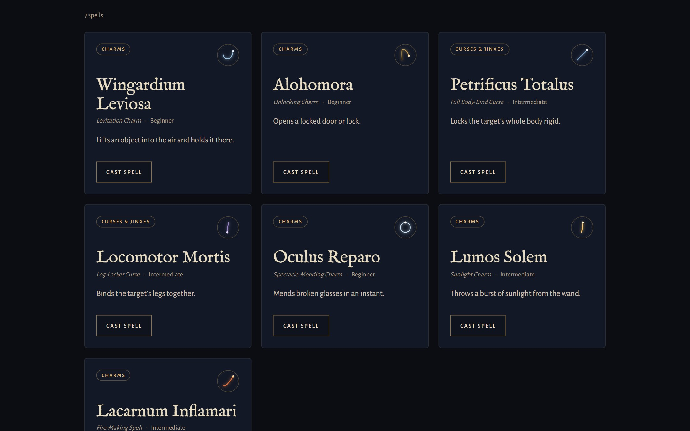
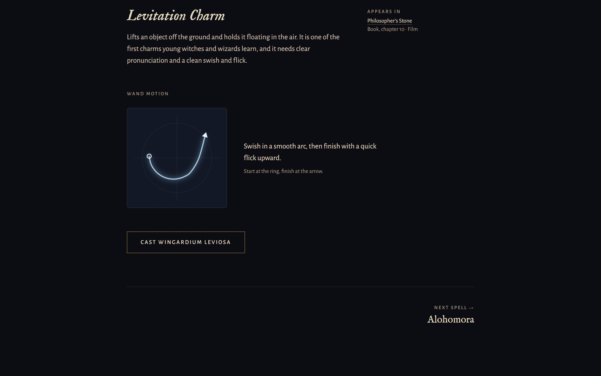
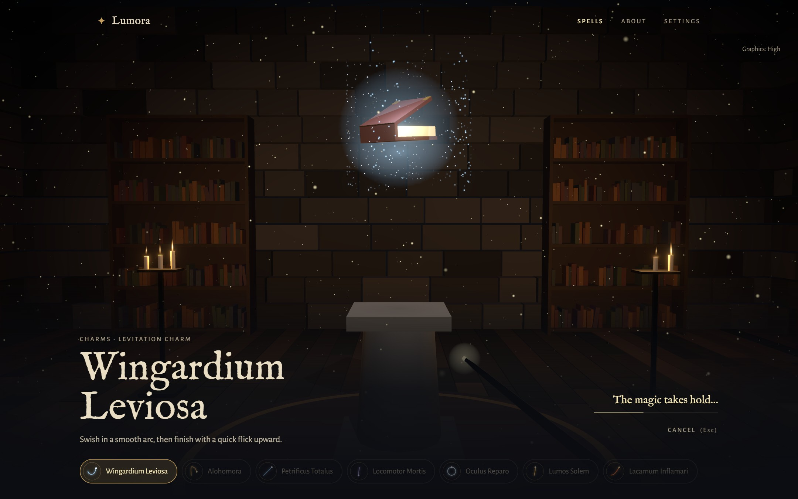
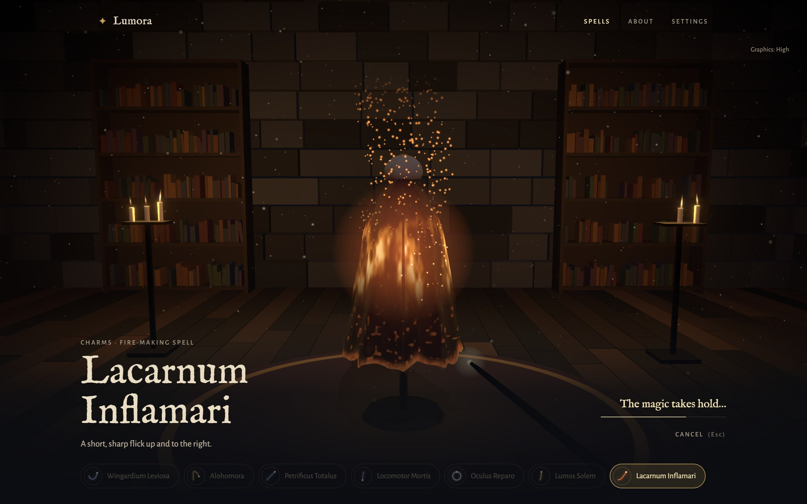
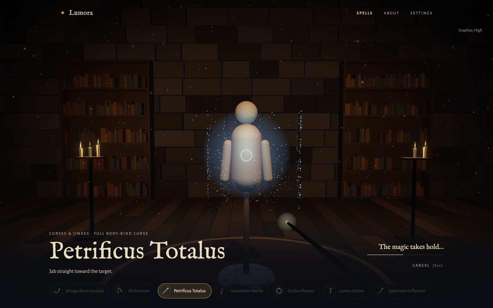
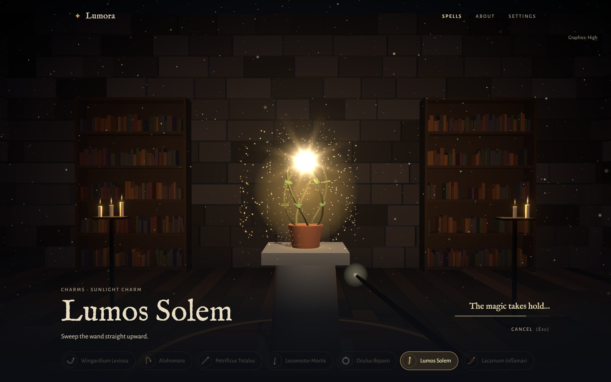

# Lumora

An unofficial, fan-made 3D spell-casting experience. Pick a spell from _Harry Potter and the Philosopher’s Stone_, learn it, and cast it in a candlelit chamber.

**[Live demo](https://lumora-tau-mauve.vercel.app/)**



> Not affiliated with or endorsed by J.K. Rowling, Warner Bros., or Wizarding World Digital. All 3D art, sound, and writing are original. See [docs/ASSETS.md](docs/ASSETS.md).

## What's inside

Seven spells: every one cast with spoken words in the first book or its film. Each has its own page, its own target in the chamber, and its own outcome — nothing is a reskin of a generic "spell effect".

### Browse the library



Search by name or effect, and filter by category, difficulty, or whether the spell appears in the book, the film, or both. Filters live in the URL, so any view can be linked or shared.

### Learn a spell



Every spell page carries its pronunciation, what the spell does, where it appears in the book and film, and its wand motion drawn as a diagram. Pages are statically generated with their own metadata, structured data, and share image.

### Cast it



A cast runs as a timed state machine — `idle → preparing → casting → projectile → impact → effect → completed` — and every system subscribes to the same timeline: the 3D scene, the synthesised sound, the camera, and the room's own reactions, like candles guttering as the spell passes. Space casts, Esc cancels, R resets.

Or say it out loud. Press the microphone, speak an incantation, and the chamber turns to that spell's target and casts it — including a spell other than the one on screen. What you say is scored against all seven incantations by spelling and by sound, so an imperfect "petrificus totalis" still lands, while anything that isn't a spell is shown back to you instead of being cast.

|                                                                                                                                                      |                                                                                                                                                                                                                     |
| ---------------------------------------------------------------------------------------------------------------------------------------------------- | ------------------------------------------------------------------------------------------------------------------------------------------------------------------------------------------------------------------- |
|  |                                                         |
| **Lacarnum Inflamari** — the cloak catches, the flame climbs, and the hem burns away.                                                                | **Petrificus Totalus** — frost creeps over the dummy, its limbs clamp, and it rocks on its base.                                                                                                                    |
|                 | Three more wait in the chamber: **Alohomora** shatters a ward and swings the door open, **Locomotor Mortis** cinches glowing bands around a dummy's legs, and **Oculus Reparo** draws a cracked lens back together. |
| **Lumos Solem** — sunlight blooms from the wand and the vines shrink back from it.                                                                   |                                                                                                                                                                                                                     |

Outcomes hold once the spell lands. The door stays open, the dummy stays frozen, the cloak stays charred — until you cast again or switch spells, when the scene eases back to the beginning.

## How it's built

- **Spells are data.** No spell has a component of its own. Each is a schema-validated definition — timeline, visual effect, target prop, sound cues, room reactions — that generic systems interpret. Adding one is a data entry plus an outcome module: see [docs/ADDING_A_SPELL.md](docs/ADDING_A_SPELL.md).
- **Outcome timing is pure TypeScript.** How far the book has risen or the hem has burnt at a given moment is a plain function of time, with no renderer in sight. The 3D performer samples it every frame and the audio schedules from the same functions, so picture and sound agree without knowing about each other — and both are unit-testable.
- **Nothing is downloaded to make it look or sound like this.** The room, the props, the wand, and the spell effects are procedural geometry and shaders. Every sound is synthesised with Web Audio at runtime — bells, celesta sparkles, a fluttering fire roar, all played into a generated stone-hall reverb. There are no models, textures, or audio files, so there is nothing to license and nothing to load.
- **WebGL is a progressive enhancement.** Content routes ship no Three.js, React Three Fiber, or GSAP at all; the chamber is a client-only island loaded on demand. Without WebGL2, every spell is still fully readable as server-rendered HTML.
- **Dependencies point inward.** The domain layer knows nothing about React, Next.js, or Three.js, and ESLint enforces the boundary.
- **Performance is budgeted, not hoped for.** A device probe picks a quality tier (overridable in Settings), the chamber drops a tier if the frame rate sits below 45 fps for three seconds, and it idles at 30 fps when nothing is moving. The limits live in [`src/config/performance.ts`](src/config/performance.ts) and are enforced against a production build by the E2E suite: 185 KiB gzip of JavaScript on content routes, 520 KiB on a cast page, and 150 draw calls per frame (60 on low).
- **Accessibility is part of the feature, not a pass at the end.** Casting works from the keyboard, focus is visible and managed, and reduced motion is respected — spells still run to completion, they just stop flickering and pulsing.

## Testing

| Suite                     | What it covers                                                                                                                                  |
| ------------------------- | ----------------------------------------------------------------------------------------------------------------------------------------------- |
| 235 unit tests (Vitest)   | The domain, cast machine, spell engine, outcome timing, audio synthesis, and components                                                         |
| 60 E2E cases (Playwright) | Every spell cast end to end on desktop and mobile Chromium, asserting what the scene actually did through a probe, plus the performance budgets |

## Status

| Phase | Scope                                                                               | State   |
| ----- | ----------------------------------------------------------------------------------- | ------- |
| 1     | Foundation: tooling, domain model, dataset, registry, stores, design system, routes | Done    |
| 2     | Cinematic landing page: wand-light hero, enter-the-chamber transition, spell index  | Done    |
| 3     | Spell library: search, URL filters, wand-motion diagrams, sigils, SEO, /books       | Done    |
| 4     | 3D chamber: candlelit room, six target props, wand, quality tiers, fallbacks        | Done    |
| 5     | Spell Engine: cast any spell (gesture, projectile, impact, room reactions, sound)   | Done    |
| 6     | Wingardium Leviosa end to end: the book lifts, floats, turns, and settles back      | Done    |
| 7     | Each remaining spell's own outcome                                                  | Done    |
| 8     | Performance: real-GPU measurements, budgets enforced in E2E, idle frame rate        | Done    |
| 9–10  | Mobile, polish                                                                      | Planned |

## Getting started

Requires Node.js 22.13 or later.

```bash
npm install
npm run dev          # http://localhost:3000
```

In production, set `NEXT_PUBLIC_SITE_URL` (the deployment uses `https://lumora-tau-mauve.vercel.app`) so canonical links, structured data, and share images use the real domain.

| Script              | What it does                                             |
| ------------------- | -------------------------------------------------------- |
| `npm run check`     | Type check, lint, format check, and unit tests           |
| `npm run typecheck` | Generates route types, then runs `tsc --noEmit`          |
| `npm run lint`      | ESLint, including layer-boundary rules                   |
| `npm test`          | Vitest unit and component tests                          |
| `npm run test:e2e`  | Playwright on desktop and mobile Chromium (builds first) |
| `npm run format`    | Prettier with Tailwind class sorting                     |

For the first E2E run, install the browser with `npx playwright install chromium`.

## Stack

Next.js 16 (App Router, Turbopack) · React 19 · TypeScript (strict) · Tailwind CSS 4 · Zustand · Zod · Vitest + Testing Library · Playwright. Three.js, React Three Fiber, and postprocessing load only on chamber routes. GSAP (cast timelines) is also chamber-only.

## Documentation

- [Architecture](docs/ARCHITECTURE.md): layers, folder structure, rendering and loading strategy
- [Spell system](docs/SPELL_SYSTEM.md): domain model, state machine, engine contract
- [Adding a spell](docs/ADDING_A_SPELL.md): step-by-step
- [Performance](docs/PERFORMANCE.md): tiers, budgets, measurement
- [Assets](docs/ASSETS.md): IP rules and licensing
